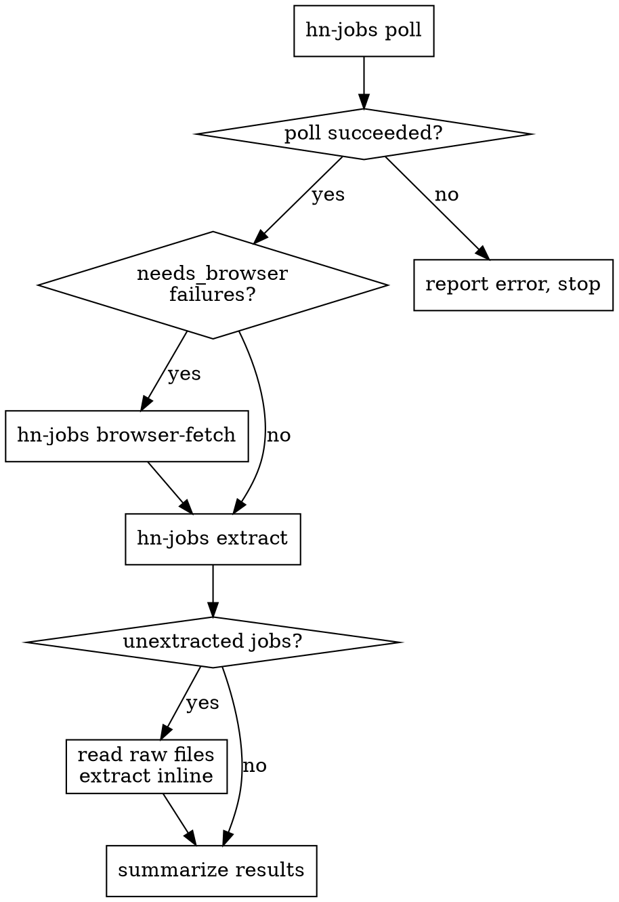

# HN Jobs Pipeline

Poll HN /jobs, fetch raw descriptions, extract structured data. Single entry point for the full workflow.

## Flow



### Step 1: Poll

```bash
hn-jobs poll
```

Captures stdout. If exit code 1, report the error and stop.

### Step 1.5: Browser fallback

Check the poll output for "Needs agent-browser:" lines on stderr. If any jobs failed with `needs_browser`, run the built-in browser fallback:

```bash
hn-jobs browser-fetch
```

This automatically:
1. Loads all `needs_browser` failures from state.json (with their URLs)
2. For each, uses `agent-browser open <url>` + `agent-browser get text body` to fetch JS-rendered content
3. Writes successful fetches to `data/raw/<item_id>.txt` and marks them as fetched in state
4. Reports any jobs that still fail after browser fetch

If `agent-browser` is not installed, skip this step and note it in the summary.

### Step 2: List unextracted jobs

```bash
hn-jobs extract
```

Captures list of unextracted item IDs and their raw file paths. If empty, skip to summary.

### Step 3: Extract (inline, no subagents)

Read all unextracted raw files (up to 5 at a time via parallel Read calls). For each file, extract a `JobDescription` JSON object following the schema in the `extract-job` skill. Append each JSON line to `data/jobs.jsonl`.

Process **all** unextracted jobs in the current run — no batch limit, no re-run required.

1. Read `data/raw/<item_id>.txt` (batch parallel reads, up to 5 at a time)
2. For each raw file, extract fields per the `extract-job` skill schema
3. Append one JSON object per line to `data/jobs.jsonl`
4. Repeat until all unextracted jobs are processed

### Step 4: Summarize

Print a summary of this run:
- Jobs discovered by poll (new + retried)
- Jobs extracted this run (one line each: company, title, location)
- Jobs that failed extraction (with reason)

## Error Handling

- **Poll failure:** Stop immediately. Don't extract against stale state.
- **Browser fallback failure:** Log it, continue with remaining jobs. Include `browser_timeout`, `browser_error`, or `browser_insufficient` in the summary. These jobs won't have raw files and will be skipped during extraction.
- **Single extraction failure:** Log it, continue with remaining jobs, include in summary.
- **JSONL write failure:** Report explicitly. Never silently drop a result.
